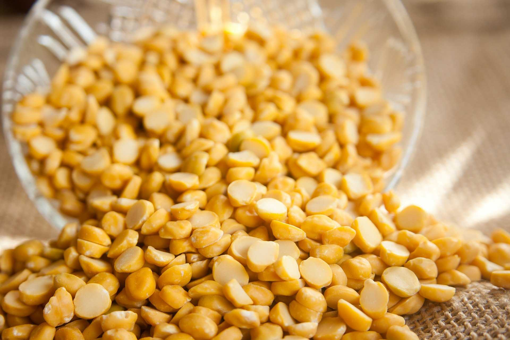

# Login Daal

Login Daal is an end-to-end login solution for web applications.
Many web applications need a user login and registration solution.
Often, this is invented over and over again. You can use Login Daal
as a ready-made solution or you can study and adapt it.

In Hindi daal is lentil which is very delicious :), especially a Daal soup. Thus the name Login Daal.

Currently, Login Daal consists of two parts. (1) login-frontend is
the JavaScript frontend written in Vue and BootstrapVue. It connects
to the (2) login-mock. Login-mock is a simple mock server that
always returns a success message except for emails err@x.com.

You can find instructions on how to install and run both of these
applications in their respective directories.

Read more about Login Daal in my blog: https://www.tderflinger.com/en/login-solution-bootstrapvue

## Components

The frontend consists of these components:

- Vue with TypeScript
- bootstrap-vue
- facebook-login-vuejs
- vuelidate

The mock consists of this component:

- json-server

## Future Plans

- make Login Daal configurable
- provide a real backend
- 2FA authentication
- support for Docker
- deployment support

## Thanks to

- Ulrike Thiel for the screen designs (https://ulrike-thiel.de)
- PDPics for the image of the lentils
